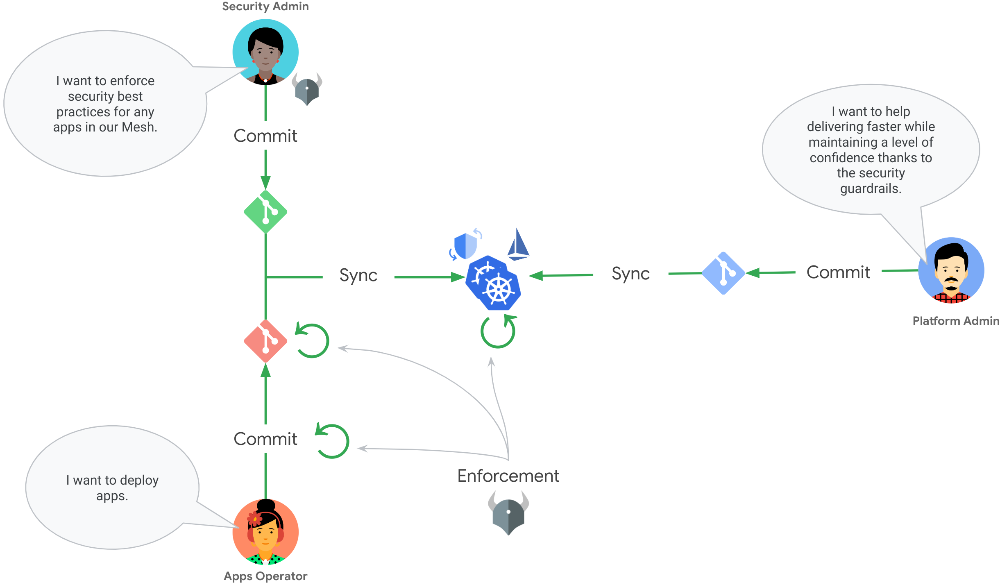

# Istio + Gatekeeper demos

Demos delivered at:
- [IstioCon 2022](https://events.istio.io/istiocon-2022/sessions/gatekeeper-istio/)
- [GitOpsCon 2022](https://sched.co/1AR95)

The demos will work with the two following setups, choose one:
- [Istio and Gatekeeper on GKE](docs/setups/setup-istio-gatekeeper-gke.md)
- [Google Service Mesh and Policy Controller on GKE](docs/setups/setup-asm-poco-gke.md)

There are three demos available:
1. [Deploy manifests with `kubectl apply` commands](docs/demos/demo-kubectl-apply.md)
1. [Sync manifests with Config Sync](docs/demos/demo-config-sync.md)
1. [Shift enforcement left](docs/demos/demo-shift-enforcement-left.md)

