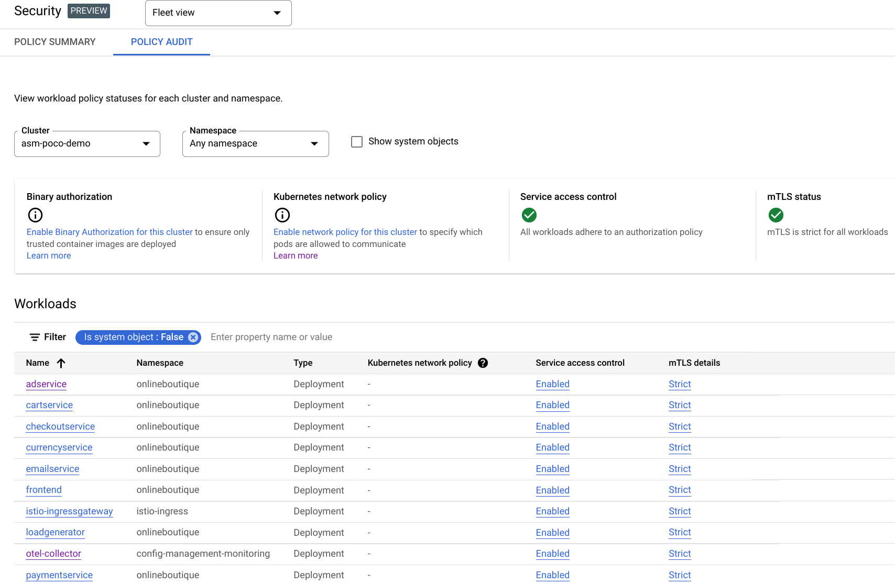
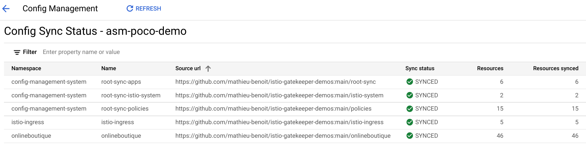

# Demos with Config Sync

With these demos you will be able to:
- Sync the Ingress Gateway and the Online Boutique apps
- Enforce Istio sidecar injection
- Enforce `STRICT` mTLS in the Mesh
- Enforce `AuthorizationPolicies`
- Clean up

As prerequisites, you need to have these tools installed:
- [`kubectl`](https://kubernetes.io/docs/tasks/tools/#kubectl)

## Sync the Ingress Gateway and the Online Boutique apps

Sync the Ingress Gateway and the Online Boutique apps in dedicated namespaces with the `istio-ingress istio-injection=enabled` label:
```bash
cat << EOF | kubectl apply -f -
apiVersion: configsync.gke.io/v1beta1
kind: RootSync
metadata:
  name: root-sync-apps
  namespace: config-management-system
spec:
  sourceFormat: unstructured
  git:
    repo: https://github.com/mathieu-benoit/istio-gatekeeper-demos
    revision: HEAD
    branch: main
    dir: root-sync
    auth: none
EOF
```

Wait for the public IP address to be provisioned:
```bash
until kubectl get svc istio-ingressgateway -n istio-ingress -o jsonpath='{.status.loadBalancer}' | grep "ingress"; do : ; done
```

Open the generated public IP address to browse the Online Boutique website:
```bash
echo -n "http://" && \
kubectl get svc istio-ingressgateway -n istio-ingress -o json | jq -r '.status.loadBalancer.ingress[0].ip'
```

## Enforce Policies

```bash
cat << EOF | kubectl apply -f -
apiVersion: configsync.gke.io/v1beta1
kind: RootSync
metadata:
  name: root-sync-policies
  namespace: config-management-system
spec:
  sourceFormat: unstructured
  git:
    repo: https://github.com/mathieu-benoit/istio-gatekeeper-demos
    revision: HEAD
    branch: main
    dir: policies
    auth: none
EOF
```

Verify that the `ConstraintTemplates` have been deployed successfully:
```bash
kubectl get constrainttemplates
```

Output similar to:
```output
NAME                         AGE
allowedserviceportname       47s
authzpolicydefaultdeny       47s
destinationruletlsenabled    47s
k8srequiredlabels            47s
peerauthnmeshstrictmtls      47s
peerauthnstrictmtls          47s
sidecarinjectionannotation   47s
```

Verify that the `Constraints` has been deployed successfully:
```bash
kubectl get constraints
```

Output similar to:
```output
NAME                                                                            ENFORCEMENT-ACTION   TOTAL-VIOLATIONS
peerauthnstrictmtls.constraints.gatekeeper.sh/peer-authentication-strict-mtls   deny                 0

NAME                                                                                ENFORCEMENT-ACTION   TOTAL-VIOLATIONS
sidecarinjectionannotation.constraints.gatekeeper.sh/sidecar-injection-annotation   deny                 0

NAME                                                                               ENFORCEMENT-ACTION   TOTAL-VIOLATIONS
destinationruletlsenabled.constraints.gatekeeper.sh/destination-rule-tls-enabled   deny                 0

NAME                                                                                   ENFORCEMENT-ACTION   TOTAL-VIOLATIONS
authzpolicydefaultdeny.constraints.gatekeeper.sh/default-deny-authorization-policies   dryrun               1

NAME                                                                            ENFORCEMENT-ACTION   TOTAL-VIOLATIONS
k8srequiredlabels.constraints.gatekeeper.sh/namespace-sidecar-injection-label   deny                 0

NAME                                                                    ENFORCEMENT-ACTION   TOTAL-VIOLATIONS
allowedserviceportname.constraints.gatekeeper.sh/port-name-constraint   deny                 0

NAME                                                                       ENFORCEMENT-ACTION   TOTAL-VIOLATIONS
peerauthnmeshstrictmtls.constraints.gatekeeper.sh/mesh-level-strict-mtls   dryrun               1
```

In order to have `peerauthnmeshstrictmtls` and `authzpolicydefaultdeny` `Constraints` working, we needed to extend the default Gatekeeper config in order to take into account Istio resources.

## Enforce Istio sidecar injection

Here are the two policies previously deployed in order to guarantee that the wokloads are included in the Mesh:
- `K8sRequiredLabels` - requires any `Namespace` in the mesh to contain the specific Istio sidecar proxy injection label: `istio-injection` with the value `enabled`
- `SidecarInjectionAnnotation` - prohibits any `Pod` in the mesh to by-pass the Istio proxy sidecar injection

Try to create a `test` namespace without the required `label`:
```bash
kubectl create namespace test
```

Output similar to:
```output
Error from server (Forbidden): admission webhook "validation.gatekeeper.sh" denied the request: [namespace-sidecar-injection-label] you must provide labels: {"istio-injection"}
```

## Enforce `STRICT` mTLS in the Mesh

Here are the three policies previously deployed in order to guarantee `STRICT` mTLS in the Mesh:
- `PeerAuthnMeshStrictMtls` - requires a default `STRICT` mTLS `PeerAuthentication` for the entire mesh in the `istio-system` namespace
- `PeerAuthnStrictMtls` - prohibits disabling `STRICT` mTLS for all `PeerAuthentications`
- `DestinationRuleTLSEnabled` - prohibits disabling `STRICT` mTLS for all hosts and host subsets in `DestinationRules`

We could look at the violation detected for the  `PeerAuthnMeshStrictMtls` `Constraint` to get more details:
```bash
kubectl get peerauthnmeshstrictmtls.constraints.gatekeeper.sh/mesh-level-strict-mtls \
    -ojsonpath='{.status.violations}' | jq
```

The output is similar to:
```output
[
  {
    "enforcementAction": "dryrun",
    "kind": "Namespace",
    "message": "Root namespace <istio-system> does not have a strict mTLS PeerAuthentication",
    "name": "istio-system"
  }
]
```

## Enforce `AuthorizationPolicies`

Here is the policy previously deployed in order to guarantee that the default `AuthorizationPolicy` in the Mesh is denying all request:
- `AuthzPolicyDefaultDeny` - requires a default `deny` `AuthorizationPolicy` for the entire mesh in the `istio-system` namespace

We could look at the violation detected for the `AuthzPolicyDefaultDeny` `Constraint` to get more details:
```bash
kubectl get authzpolicydefaultdeny.constraints.gatekeeper.sh/default-deny-authorization-policies \
    -ojsonpath='{.status.violations}' | jq
```

The output is similar to:
```output
[
  {
    "enforcementAction": "dryrun",
    "kind": "Namespace",
    "message": "Root namespace <istio-system> does not have a default deny AuthorizationPolicy",
    "name": "istio-system"
  }
]
```

## Fix the policies violations

We could fix these violations by deploying the default deny-all `AuthorizationPolicy` and the default `STRICT` `PeerAuthentication` in the `istio-system` namespace:
```bash
cat << EOF | kubectl apply -f -
apiVersion: configsync.gke.io/v1beta1
kind: RootSync
metadata:
  name: root-sync-istio-system
  namespace: config-management-system
spec:
  sourceFormat: unstructured
  git:
    repo: https://github.com/mathieu-benoit/istio-gatekeeper-demos
    revision: HEAD
    branch: main
    dir: istio-system
    auth: none
EOF
```

After a few minutes, verify that the `Constraints` don't have any remaining violations:
```bash
kubectl get constraints
```

The output is similar to:
```output
NAME                                                                                   ENFORCEMENT-ACTION   TOTAL-VIOLATIONS
authzpolicydefaultdeny.constraints.gatekeeper.sh/default-deny-authorization-policies   dryrun               0

NAME                                                                            ENFORCEMENT-ACTION   TOTAL-VIOLATIONS
k8srequiredlabels.constraints.gatekeeper.sh/namespace-sidecar-injection-label   deny                 0

NAME                                                                    ENFORCEMENT-ACTION   TOTAL-VIOLATIONS
allowedserviceportname.constraints.gatekeeper.sh/port-name-constraint   deny                 0

NAME                                                                       ENFORCEMENT-ACTION   TOTAL-VIOLATIONS
peerauthnmeshstrictmtls.constraints.gatekeeper.sh/mesh-level-strict-mtls   dryrun               0

NAME                                                                            ENFORCEMENT-ACTION   TOTAL-VIOLATIONS
peerauthnstrictmtls.constraints.gatekeeper.sh/peer-authentication-strict-mtls   deny                 0

NAME                                                                                ENFORCEMENT-ACTION   TOTAL-VIOLATIONS
sidecarinjectionannotation.constraints.gatekeeper.sh/sidecar-injection-annotation   deny                 0

NAME                                                                               ENFORCEMENT-ACTION   TOTAL-VIOLATIONS
destinationruletlsenabled.constraints.gatekeeper.sh/destination-rule-tls-enabled   deny                 0
```

Visit the Online Boutique website from your browser, you should still see it working successfully.


Congrats! You have secured your cluster, your mesh and your Online Boutique website with `STRICT` mTLS and fine granular `AuthorizationPolicies`, while enforcing this secure setup with associated policies and `Constraints`!

If you are using Google Service Mesh, you could see these security features here:


Here is the summary of the `RootSyncs` and `RepoSyncs` you have configured with Config Sync:
