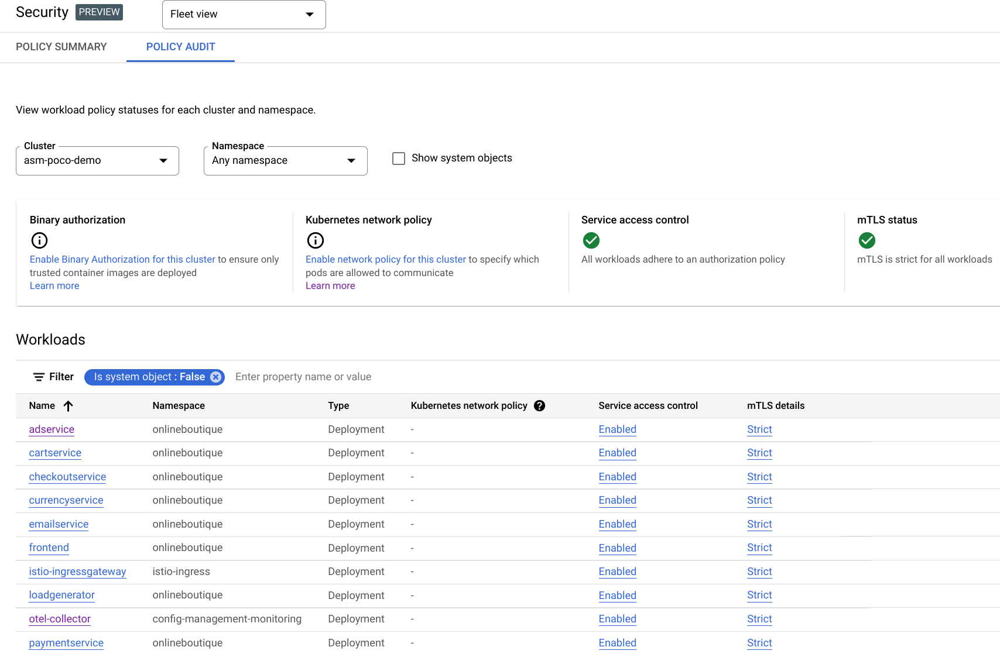
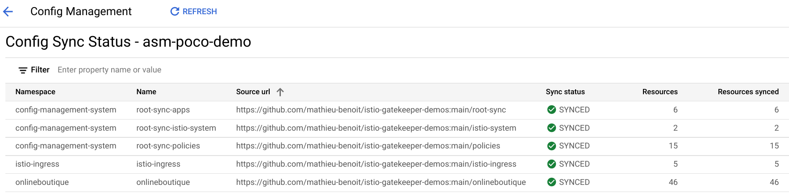

# Demos with Config Sync

With this demo you will be able to:
- Sync the Ingress Gateway and the Online Boutique apps
- Enforce policies
  - Istio sidecar injection policy enforcement
  - `STRICT` mTLS in the Mesh policy enforcement
  - `AuthorizationPolicies` policy enforcement
- Fix the policies violations

As prerequisites, you need to have these tools installed:
- [`kubectl`](https://kubernetes.io/docs/tasks/tools/#kubectl)

## Sync the Ingress Gateway and the Online Boutique apps

Sync the Ingress Gateway and the Online Boutique apps in dedicated namespaces with the `istio-ingress istio-injection=enabled` label:
```bash
cat << EOF | kubectl apply -f -
apiVersion: configsync.gke.io/v1beta1
kind: RootSync
metadata:
  name: root-sync-apps
  namespace: config-management-system
spec:
  sourceFormat: unstructured
  git:
    repo: https://github.com/mathieu-benoit/istio-gatekeeper-demos
    revision: HEAD
    branch: main
    dir: root-sync
    auth: none
EOF
```
This `RootSync` will sync the manifests contained in the [`root-sync` folder](../../root-sync/). This folder contains the `RepoSyncs` in order to sync both Ingress Gateway and the Online Boutique apps. Each `RepoSync` has also it's own `RoleBinding` in order to sync Istio resources.

Wait for the `RootSync` to be synced:
```bash
kubectl get rootsync -A
```
```output
NAMESPACE                  NAME             RENDERINGCOMMIT                            RENDERINGERRORCOUNT   SOURCECOMMIT                               SOURCEERRORCOUNT   SYNCCOMMIT                                 SYNCERRORCOUNT
config-management-system   root-sync-apps   82b96a9a1a70646c3251ec8edbe5274a4ab14f73                         82b96a9a1a70646c3251ec8edbe5274a4ab14f73                      82b96a9a1a70646c3251ec8edbe5274a4ab14f73
```

Wait for the 3 `RepoSyncs` to be synced:
```bash
kubectl get reposync -A
```
```output
NAMESPACE        NAME        RENDERINGCOMMIT                            RENDERINGERRORCOUNT   SOURCECOMMIT                               SOURCEERRORCOUNT   SYNCCOMMIT                                 SYNCERRORCOUNT
best-app-ever    repo-sync   82b96a9a1a70646c3251ec8edbe5274a4ab14f73                         82b96a9a1a70646c3251ec8edbe5274a4ab14f73                      82b96a9a1a70646c3251ec8edbe5274a4ab14f73   
istio-ingress    repo-sync   82b96a9a1a70646c3251ec8edbe5274a4ab14f73                         82b96a9a1a70646c3251ec8edbe5274a4ab14f73                      82b96a9a1a70646c3251ec8edbe5274a4ab14f73   
onlineboutique   repo-sync   82b96a9a1a70646c3251ec8edbe5274a4ab14f73                         82b96a9a1a70646c3251ec8edbe5274a4ab14f73                      82b96a9a1a70646c3251ec8edbe5274a4ab14f73
```

Check that the Istio sidecar proxies have been injected and successfully deployed:
```bash
istioctl version
```
```output
client version: 1.15.2
control plane version: 1.15.2
data plane version: 1.15.2 (13 proxies)
```
_Note: `13 proxies` = 12 from `onlineboutique` + 1 from `istio-ingress`._

Wait for the public IP address to be provisioned:
```bash
until kubectl get svc istio-ingressgateway -n istio-ingress -o jsonpath='{.status.loadBalancer}' | grep "ingress"; do : ; done
```

Open the generated public IP address to browse the Online Boutique website:
```bash
echo -n "http://" && \
kubectl get svc istio-ingressgateway -n istio-ingress -o json | jq -r '.status.loadBalancer.ingress[0].ip'
```

## Enforce policies

```bash
cat << EOF | kubectl apply -f -
apiVersion: configsync.gke.io/v1beta1
kind: RootSync
metadata:
  name: root-sync-policies
  namespace: config-management-system
spec:
  sourceFormat: unstructured
  git:
    repo: https://github.com/mathieu-benoit/istio-gatekeeper-demos
    revision: HEAD
    branch: main
    dir: policies
    auth: none
EOF
```
This `RootSync` will sync the manifests contained in the [`policies` folder](../../policies/). This folder contains the `Constraints` and `ConstraintTemplates` as well as the Gatekeeper config ([`referential-constraints-config.yaml`](../../policies/gatekeeper-system/referential-constraints-config.yaml)) in order to evaluate the referential constraints.

Wait for the `RootSync` to be synced:
```bash
kubectl get rootsync -A
```
```output
NAMESPACE                  NAME                 RENDERINGCOMMIT                            RENDERINGERRORCOUNT   SOURCECOMMIT                               SOURCEERRORCOUNT   SYNCCOMMIT                                 SYNCERRORCOUNT
config-management-system   root-sync-apps       82b96a9a1a70646c3251ec8edbe5274a4ab14f73                         82b96a9a1a70646c3251ec8edbe5274a4ab14f73                      82b96a9a1a70646c3251ec8edbe5274a4ab14f73   
config-management-system   root-sync-policies   82b96a9a1a70646c3251ec8edbe5274a4ab14f73                         82b96a9a1a70646c3251ec8edbe5274a4ab14f73                      82b96a9a1a70646c3251ec8edbe5274a4ab14f73
```

Verify that the `ConstraintTemplates` have been deployed successfully:
```bash
kubectl get constrainttemplates
```

Output similar to:
```output
NAME                         AGE
allowedserviceportname       115s
authzpolicydefaultdeny       115s
destinationruletlsenabled    115s
k8srequiredlabels            115s
peerauthnmeshstrictmtls      115s
peerauthnstrictmtls          115s
sidecarinjectionannotation   115s
```

Verify that the `Constraints` has been deployed successfully:
```bash
kubectl get constraints
```

Output similar to:
```output
NAME                                                                                ENFORCEMENT-ACTION   TOTAL-VIOLATIONS
sidecarinjectionannotation.constraints.gatekeeper.sh/sidecar-injection-annotation   deny                 0

NAME                                                                            ENFORCEMENT-ACTION   TOTAL-VIOLATIONS
k8srequiredlabels.constraints.gatekeeper.sh/namespace-sidecar-injection-label   deny                 0

NAME                                                                    ENFORCEMENT-ACTION   TOTAL-VIOLATIONS
allowedserviceportname.constraints.gatekeeper.sh/port-name-constraint   deny                 0

NAME                                                                                   ENFORCEMENT-ACTION   TOTAL-VIOLATIONS
authzpolicydefaultdeny.constraints.gatekeeper.sh/default-deny-authorization-policies   dryrun               1

NAME                                                                       ENFORCEMENT-ACTION   TOTAL-VIOLATIONS
peerauthnmeshstrictmtls.constraints.gatekeeper.sh/mesh-level-strict-mtls   dryrun               1

NAME                                                                               ENFORCEMENT-ACTION   TOTAL-VIOLATIONS
destinationruletlsenabled.constraints.gatekeeper.sh/destination-rule-tls-enabled   deny                 0

NAME                                                                            ENFORCEMENT-ACTION   TOTAL-VIOLATIONS
peerauthnstrictmtls.constraints.gatekeeper.sh/peer-authentication-strict-mtls   deny                 0
```

In order to have `peerauthnmeshstrictmtls` and `authzpolicydefaultdeny` `Constraints` working, we needed to extend the default Gatekeeper config to take into account the Istio resources. See the [`referential-constraints-config.yaml`](../../policies/gatekeeper-system/referential-constraints-config.yaml) file already synced in your cluster, for more details.

### Istio sidecar injection policy enforcement

Here are the two policies previously deployed in order to guarantee that the wokloads are included in the Mesh:
- `K8sRequiredLabels` - requires any `Namespace` in the mesh to contain the specific Istio sidecar proxy injection label: `istio-injection` with the value `enabled`
- `SidecarInjectionAnnotation` - prohibits any `Pod` in the mesh to by-pass the Istio proxy sidecar injection

Try to create a `test` namespace without the required `label`:
```bash
kubectl create namespace test
```

Output similar to:
```output
Error from server (Forbidden): admission webhook "validation.gatekeeper.sh" denied the request: [namespace-sidecar-injection-label] you must provide labels: {"istio-injection"}
```

### `STRICT` mTLS in the Mesh policy enforcement

Here are the three policies previously deployed in order to guarantee `STRICT` mTLS in the Mesh:
- `PeerAuthnMeshStrictMtls` - requires a default `STRICT` mTLS `PeerAuthentication` for the entire mesh in the `istio-system` namespace
- `PeerAuthnStrictMtls` - prohibits disabling `STRICT` mTLS for all `PeerAuthentications`
- `DestinationRuleTLSEnabled` - prohibits disabling `STRICT` mTLS for all hosts and host subsets in `DestinationRules`

Look at the violation detected for the  `PeerAuthnMeshStrictMtls` `Constraint` to get more details:
```bash
kubectl get peerauthnmeshstrictmtls.constraints.gatekeeper.sh/mesh-level-strict-mtls \
    -ojsonpath='{.status.violations}' | jq
```

The output is similar to:
```output
[
  {
    "enforcementAction": "dryrun",
    "kind": "Namespace",
    "message": "Root namespace <istio-system> does not have a strict mTLS PeerAuthentication",
    "name": "istio-system"
  }
]
```

### `AuthorizationPolicies` policy enforcement

Here is the policy previously deployed in order to guarantee that the default `AuthorizationPolicy` in the Mesh is denying all request:
- `AuthzPolicyDefaultDeny` - requires a default `deny` `AuthorizationPolicy` for the entire mesh in the `istio-system` namespace

Look at the violation detected for the `AuthzPolicyDefaultDeny` `Constraint` to get more details:
```bash
kubectl get authzpolicydefaultdeny.constraints.gatekeeper.sh/default-deny-authorization-policies \
    -ojsonpath='{.status.violations}' | jq
```

The output is similar to:
```output
[
  {
    "enforcementAction": "dryrun",
    "kind": "Namespace",
    "message": "Root namespace <istio-system> does not have a default deny AuthorizationPolicy",
    "name": "istio-system"
  }
]
```

## Fix the policies violations

Fix these violations by syncing the default deny-all `AuthorizationPolicy` and the default `STRICT` `PeerAuthentication` in the `istio-system` namespace:
```bash
cat << EOF | kubectl apply -f -
apiVersion: configsync.gke.io/v1beta1
kind: RootSync
metadata:
  name: root-sync-istio-system
  namespace: config-management-system
spec:
  sourceFormat: unstructured
  git:
    repo: https://github.com/mathieu-benoit/istio-gatekeeper-demos
    revision: HEAD
    branch: main
    dir: istio-system
    auth: none
EOF
```
This `RootSync` will sync the manifests contained in the [`istio-system` folder](../../istio-system/).

Wait for the `RootSync` to be synced:
```bash
kubectl get rootsync -A
```
```output
NAMESPACE                  NAME                     RENDERINGCOMMIT                            RENDERINGERRORCOUNT   SOURCECOMMIT                               SOURCEERRORCOUNT   SYNCCOMMIT                                 SYNCERRORCOUNT
config-management-system   root-sync-apps           cd74a14de51de93046b8040c217c9bd4ebafc14c                         cd74a14de51de93046b8040c217c9bd4ebafc14c                      cd74a14de51de93046b8040c217c9bd4ebafc14c   
config-management-system   root-sync-istio-system   cd74a14de51de93046b8040c217c9bd4ebafc14c                         cd74a14de51de93046b8040c217c9bd4ebafc14c                      cd74a14de51de93046b8040c217c9bd4ebafc14c   
config-management-system   root-sync-policies       cd74a14de51de93046b8040c217c9bd4ebafc14c                         cd74a14de51de93046b8040c217c9bd4ebafc14c                      cd74a14de51de93046b8040c217c9bd4ebafc14c
```

After a few minutes, verify that the `Constraints` don't have any remaining violations:
```bash
kubectl get constraints
```

The output is similar to:
```output
NAME                                                                                ENFORCEMENT-ACTION   TOTAL-VIOLATIONS
sidecarinjectionannotation.constraints.gatekeeper.sh/sidecar-injection-annotation   deny                 0

NAME                                                                            ENFORCEMENT-ACTION   TOTAL-VIOLATIONS
k8srequiredlabels.constraints.gatekeeper.sh/namespace-sidecar-injection-label   deny                 0

NAME                                                                    ENFORCEMENT-ACTION   TOTAL-VIOLATIONS
allowedserviceportname.constraints.gatekeeper.sh/port-name-constraint   deny                 0

NAME                                                                                   ENFORCEMENT-ACTION   TOTAL-VIOLATIONS
authzpolicydefaultdeny.constraints.gatekeeper.sh/default-deny-authorization-policies   dryrun               0

NAME                                                                       ENFORCEMENT-ACTION   TOTAL-VIOLATIONS
peerauthnmeshstrictmtls.constraints.gatekeeper.sh/mesh-level-strict-mtls   dryrun               0

NAME                                                                               ENFORCEMENT-ACTION   TOTAL-VIOLATIONS
destinationruletlsenabled.constraints.gatekeeper.sh/destination-rule-tls-enabled   deny                 0

NAME                                                                            ENFORCEMENT-ACTION   TOTAL-VIOLATIONS
peerauthnstrictmtls.constraints.gatekeeper.sh/peer-authentication-strict-mtls   deny                 0
```

Visit the Online Boutique website from your browser, you should still see it working successfully.


Congrats! You have secured your cluster, your mesh and your Online Boutique website with `STRICT` mTLS and fine granular `AuthorizationPolicies`, while enforcing this secure setup with associated policies and `Constraints`!

If you are using Google Service Mesh, you could see these security features here:


Here is the summary of the `RootSyncs` and `RepoSyncs` you have configured with Config Sync:
